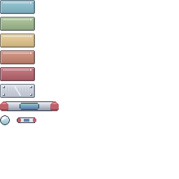

#  IA Arkanoid

Arkanoid variant with JSON maps for training and evaluating AI agents, built on [`ai-game-framework`](https://pypi.org/project/ai-game-framework/).

---

## Architecture & Features

1. **Backend Simulation Engine (`server/logic.py`)**:
   - `numpy`-based swept (continuous) collision detection with specular reflection; constant ball speed.
   - **Scores**: raw score and normalized score (points per second of simulated time), so stalling is penalized.
   - **3-Region Paddle Physics** (angles from the vertical, triangular distribution inside each cone):
     - **Center third**: straight up (90° from horizontal) with a cone of ±α (`alpha_deg`, default 8°).
     - **Left third**: 45° to the left with a cone of ±β (`beta_deg`, default 15°).
     - **Right third**: 45° to the right with a cone of ±β.
     - α < β is enforced when `config.json` is loaded (`paddle.angles`: `alpha_deg`, `side_deg`, `beta_deg`).
   - **Scoring**: points are awarded only when a brick breaks (its `points` value) with no per-hit points and no stage-clear bonus; damaging a multi-hit brick or bouncing off metal scores nothing.

2. **Configuration & Maps (`config.json`, `maps/`)**:
   - Constants externalized in [`config.json`](config.json) (screen dimensions, paddle size/speed, ball radius/speed, brick types, point values).
   - Maps stored in [`maps/`](maps/) as modular JSON files:
     - All bricks share uniform dimensions (50x20).
     - Variable health/durability (1-hit red, 2-hit blue, 3-hit green, 4-hit yellow).
     - **Indestructible Metal Bricks**: Deflect the ball without taking damage.
     - **Level Progression**: Advances to the next level when all destructible bricks are eliminated, even while metal bricks remain on screen.
   - Includes 3 pre-built levels:
     - [`maps/level1.json`](maps/level1.json): Classic assault wall with corner metal anchors.
     - [`maps/level2.json`](maps/level2.json): Diamond pyramid with tiered health bricks and metal bastions.
     - [`maps/level3.json`](maps/level3.json): Iron fortress with metal columns and 4-hit gold bricks.

3. **Frontend Visualizer (`viewer/viewer.py`)**:
   - Pygame-based desktop visualizer connecting via WebSocket.
   - Nord-palette pixel-art sprite sheet ([`assets/sprites.png`](assets/sprites.png), regenerated by `viewer/sprites.py`): gradient-shaded glossy bricks colored by remaining hits like the brick types (red 1 hit, blue 2, green 3, yellow 4), riveted steel metal bricks, Vaus-style paddle with red end caps and a frost core, and a shaded ball.
   - Real-time arcade HUD showing stage, elapsed timer, raw score, normalized score rate (pts/s), high score, and lives.

4. **Autonomous & Manual Agents (`agents/`)**:
   - [`DummyAgent`](agents/dummy_agent.py): Samples uniformly from `valid_actions` or stays idle.
   - [`ManualAgent`](agents/manual_agent.py): Interactive terminal keyboard driver with live ANSI HUD and A/D or Arrow keys.

5. **CI Pipeline & Pre-commit Quality Gate**:
   - Git pre-commit hooks (system-installed tools):
     - `ruff` (linter and import formatter)
     - `basedpyright` (static type checker)
     - `vulture` (dead code detection)
     - `unittest` (automated test discovery)
     - `coverage` (at least 80% test coverage)

---

## Quick Start

Run everything from the repository root (config, maps and assets use relative paths). Python 3.12 is the reference version (3.10 is the minimum supported). An agent running in inference mode can only rely on the libraries in `pyproject.toml`.

### 1. Create and activate the virtual environment

```bash
python3 -m venv venv
source venv/bin/activate        # Windows: venv\Scripts\activate
```

Create the venv once. Activate it in **each** terminal you use (the three terminals below).

### 2. Install the requirements

The requirements are declared in [`pyproject.toml`](pyproject.toml) (`[project] dependencies`: `ai-game-framework`, `numpy`, `pygame`, `websockets`). There is no `requirements.txt`; `pip` reads `pyproject.toml` directly. With the venv active, from the repository root:

```bash
pip install .
```

Do this step even if a venv is already active: creating or activating a venv does not install anything. Do not install `aigf` or similar by hand; the framework is the PyPI package `ai-game-framework` and is pulled in by the command above. Re-run `pip install .` after pulling changes that touch `pyproject.toml`. Use `pip install -e .` instead if you want edits to the packages to be picked up without reinstalling.

Check the install with `python -c "import aigf, numpy, pygame, websockets"`. If it fails with `ModuleNotFoundError`, the venv is not active or step 2 was skipped.

### 3. Launch three terminals

| Terminal | Role | Command |
|---|---|---|
| 1 | Backend (game server) | `python -m server.server` |
| 2 | Viewer (Pygame window) | `python -m viewer.viewer` |
| 3 | Agent (pick one) | `python -m agents.dummy_agent --id a12345` (bot) or `python -m agents.manual_agent --id a12345` (keyboard) |

Start the backend first, then the viewer, then the agent. The game starts when an agent connects; when it ends the server returns to the lobby and waits for a new agent.

Manual agent controls: `A` / Left Arrow = West, `D` / Right Arrow = East, `Q` = quit.

### Backend options

| Option | Default | Description |
|---|---|---|
| `--fps N` | `30` | Simulation ticks per simulated second (each agent action/state exchange is one tick). |
| `--acceleration X` | `1.0` | Wall-clock speed-up. `10` runs ten times faster; simulated time per tick is unchanged, so agent dynamics stay identical. Use it to speed up training. Capped in practice by CPU/agent latency. |
| `--levels SPEC` | all levels in `config.json` | `1`, `1,2,3`, `1-3` or mixed `1,3-5`. Level `N` is `maps/levelN.json`; a map file name also works. |
| `--level-time-limit S` | `600` | Seconds of game time allowed per level (`game.level_time_limit` in `config.json`, `0` disables). If the level is not cleared in time the game is over (`timed_out` in the state); the game only advances to the next level by clearing the current one. |
| `--share-highscore` / `--no-share-highscore` | off | Off: leaderboard lives in memory only and is lost on exit. On: scores are appended to the local `highscores.csv` and each finished game is uploaded (see below). |
| `--host`, `--port`, `--config` | `0.0.0.0`, `8765`, `config.json` | Network and config file. |

Examples:

```bash
python -m server.server --acceleration 10 --levels 1-3          # fast training run
python -m server.server --levels 2 --share-highscore            # class competition on stage 2
python -m server.server --levels 3 --level-time-limit 300       # level 3 only, 5 minutes to clear it
```

### Agent options

Both example agents (run from the repository root, with the venv active) take the same options:

| Option | Default | Description |
|---|---|---|
| `--server URI` | `ws://localhost:8765/ws` | WebSocket URI of the backend. |
| `--name TEXT` | `Dummy Agent` / `Manual Arkanoid Driver` | Display name (required non-empty); sanitized by the backend (printable ASCII, max 32 chars). |
| `--id TEXT` | `AGENT_ID` variable, else random | Agent id, sent to the backend in the handshake. It identifies the agent and is the key used to rank it in the dashboard. |

```bash
python -m agents.dummy_agent --id a12345 --name "Random bot"                  # random bot
python -m agents.manual_agent --id a12345 --server ws://192.168.1.10:8765/ws   # keyboard, remote backend
```

The id comes from, in this order:

1. `--id` on the command line, which overrides everything else;
2. the `AGENT_ID` string variable at the top of the agent module (`AGENT_ID: str | None = None`; set it to your id, e.g. `AGENT_ID = "a12345"`);
3. otherwise a random one (`uuid.uuid4().hex`, generated by the agent). A random id changes at every run, so such a run cannot be tracked in the dashboard.

The backend keeps only `[A-Za-z0-9._-]` and at most 64 characters of the id (empty after cleaning: it generates a random one) and includes it in the uploaded score (below).

Custom agents subclass `BaseAgent(server_uri, name, agent_id)` and implement `deliberate()`; `BaseAgent` resolves the id (`agent_id` or random) and sends `{"client": "agent", "name": ..., "id": ...}` in the handshake. The viewer takes only `--server` (WebSocket URI, default `ws://localhost:8765/ws`).

### Remote highscore upload (HTTP PUT)

With `--share-highscore`, every finished game (game over or victory) is sent as one `PUT` with a minimal JSON body:

```json
{"id": "a12345", "name": "ann", "score": 4200, "normalized_score": 31.5, "time_elapsed": 133.2, "level": 2, "won": true, "timed_out": false}
```

`id` is the agent id (see Agent options) and the key to rank by, `name` is the display name, `score` is the raw points, `normalized_score` is points per second, `time_elapsed` is the game time in seconds, `level` is the map number (`maps/levelN.json`) the game ended on, `won` is true when every level played was cleared and `timed_out` is true when a level exceeded its maximum duration. Ranking is left to the receiving server, which can sort by either key or use one as the tie-break for the other.

The endpoint is read from `ARKANOID_HS_URL` (default: the placeholder `HIGHSCORE_URL` in [`server/remote.py`](server/remote.py)); the companion `aigf-dashboard` service accepts it at `/api/highscores`. Set `ARKANOID_HS_TOKEN` to add an `Authorization: Bearer <token>` header (env only, never a CLI flag). The upload runs on a background thread with a 5 s timeout; failures are logged and never interrupt the game (the local CSV file still keeps the score). No retry queue yet. The service side is not part of this repo.

### High score file

With `--share-highscore`, every finished game is appended as one row to `highscores.csv` (git-ignored; columns `date,id,player,score,time_elapsed,normalized_score`, written with the standard `csv` module, so it opens in any spreadsheet). The in-game top-10 boards are rebuilt from this file at start-up on top of the arcade defaults. The file is plain text and is not tamper-proof: it is a local log, the ranking that counts is the one on the receiving server.

---

## Getting template updates

The template repository (`https://github.com/detiuaveiro/ia-arkanoid-template`) will receive bug fixes, new levels and the dashboard. A repository created from a template has its own history, so register the template once as `upstream` and merge from it whenever an update is announced:

```bash
git remote add upstream https://github.com/detiuaveiro/ia-arkanoid-template.git   # once
git fetch upstream
git merge upstream/main --allow-unrelated-histories    # first merge only; plain `git merge upstream/main` afterwards
pip install .                                          # in the active venv, in case pyproject.toml changed
```

Commit your work before merging. Files you did not touch merge cleanly; if there is a conflict, keep your changes in your own files (`student.py`, ...) and take the upstream version of the game files (`server/`, `viewer/`, `maps/`, `config.json`). Do not edit those: your agent is evaluated against the official versions.

---

## Testing & Code Quality

The quality tools (`ruff`, `basedpyright`, `vulture`, `coverage`, `pre-commit`) must be installed on the system, not in the venv.

```bash
# Run unit tests
python -m unittest discover -s tests

# Check code coverage
coverage run --source=server,agents -m unittest discover -s tests -q
coverage report --fail-under=80

# Enable and run the pre-commit hooks
pre-commit install
pre-commit run --all-files
```

---

## License

MIT, see [`LICENSE`](LICENSE).
